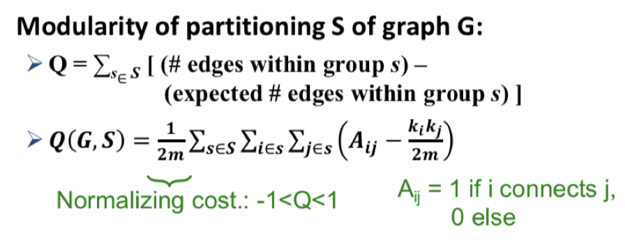

# DSCI 553: Assignment 4 - Graph Analysis and Community Detection

## Overview

This folder contains my solutions for Assignment 4 of the DSCI 553 course, which explores community detection in graphs using both the GraphFrames library and a custom implementation of the Girvan-Newman algorithm.

## Files

The folder includes the following Python scripts:

- `task1.py`: Utilizes Spark GraphFrames to detect communities via the Label Propagation Algorithm.
- `task2.py`: Implements the Girvan-Newman algorithm to detect communities based on structural betweenness.

### Task 1: Community Detection with GraphFrames

**Objective**: Detect communities in a user network graph constructed from Yelp review data, using the GraphFrames library.

**Execution**:

```bash
spark-submit --packages graphframes:graphframes:0.8.2-spark3.1-s_2.12 task1.py <filter_threshold> <input_file_path> <community_output_file_path>
```

### Task 2: Girvan-Newman Algorithm for Community Detection

**Objective**: Implement the Girvan-Newman algorithm from scratch using only Spark RDDs to find communities based on betweenness centrality.

**Execution**:

```bash
spark-submit task2.py <filter_threshold> <input_file_path> <betweenness_output_file_path> <community_output_file_path>
```

## Technologies Used

- Python 3.6
- Apache Spark 3.1.2
- GraphFrames 0.8.2
- JDK 1.8
- Scala 2.12 (Optional for additional implementation)

## Setup

To run these scripts, ensure your Spark and Python environments are correctly set up with the versions specified above. These scripts are optimized for execution on Vocareum but can be adapted for other Spark-supported platforms.

## Usage

Replace `<filter_threshold>`, `<input_file_path>`, and `<community_output_file_path>` with your actual file paths and parameters. Ensure that GraphFrames is correctly installed and configured in your Spark environment.

## Output

- **Task 1**: Outputs a text file listing communities detected by the Label Propagation Algorithm.
- **Task 2**: Outputs two text files: one for the betweenness of each edge and one for the detected communities.

## NOTICE

If you find difficulty in passing the task2.2:

1. **Stopping Criteria**: For HW-4 Task 2.2, it's essential not to halt your search prematurely at the first sign of a decrease in modularity. Continue exploring all potential partitions to find the global maximum. This approach prevents overlooking the optimal solution, ensuring a thorough and accurate result.

2. **Modularity Calculation**:
   - Ensure that for adjacency matrix `A`, `A=1` only if BOTH node `i` is connected to node `j` AND node `j` is connected to node `i`.
   - Use the current graph to determine `A` and the original graph to calculate the product of the node degrees (`ki*kj`).
   - Calculate modularity for all possible communities until no edges remain. This exhaustive check helps verify the accuracy of your solution.

Please also check the modularity equation:


